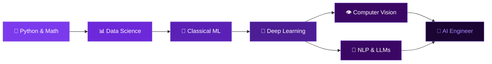

<div align="center">

<!-- Animated Header Banner -->


<!-- Typing Animation -->


<br/>

<!-- Profile Views + Followers Badges -->

&nbsp;


</div>

---

<!-- About Me Section -->


<h2>
  
  &nbsp;About Me
</h2>

```yaml
name: Mahesh Hansaka
location: Sri Lanka 🇱🇰
education: Full Stack Software Engineering @ IJSE
role: Software Engineering Student & Developer

currently_learning:
  - Deep Learning & Neural Networks
  - Machine Learning with Python
  - MLOps & Model Deployment
  - Natural Language Processing (NLP)
  - Computer Vision

interests:
  - Full Stack Development
  - Artificial Intelligence
  - Data Science
  - Open Source Contributions

goal: "To become a proficient Full Stack Developer & AI Engineer,
       building intelligent systems that solve real-world problems."
```

---

<!-- Tech Stack Section -->
<h2>
  &nbsp;
  Tech Stack & Skills
</h2>

<details open>
<summary><b>🖥️ Languages</b></summary>
<br/>


</details>

<details open>
<summary><b>🤖 AI / Machine Learning</b></summary>
<br/>


</details>

<details open>
<summary><b>🌐 Web Frameworks & Libraries</b></summary>
<br/>


</details>

<details open>
<summary><b>🗄️ Databases & Cloud</b></summary>
<br/>


</details>

<details open>
<summary><b>🛠️ Tools & DevOps</b></summary>
<br/>


</details>

---

<!-- AI/ML Learning Roadmap -->
<h2>🧠 AI & ML Learning Roadmap</h2>



---

<!-- GitHub Stats Section -->
<h2>
  &nbsp;
  GitHub Stats
</h2>

<div align="center">


<br/><br/>


</div>

---

<!-- Activity Graph -->
<h2>📈 Contribution Activity</h2>


---

<!-- Projects Section -->
<h2>
  &nbsp;
  Featured Projects
</h2>

<div align="center">

| 🚀 Project | 🛠️ Tech Stack | 🌟 Description |
|:---:|:---:|:---|
| 🛍️ **E-Commerce Platform** | Spring Boot + React + MySQL | Full-stack web app with auth, cart, payments & admin dashboard |
| 📱 **POS System** | Java + JavaFX + MySQL | Point of Sale system with inventory & billing management |
| 🤖 **ML Classifier** *(coming soon)* | Python + TensorFlow + FastAPI | Deep learning model served via REST API |
| 🧠 **NLP Sentiment Tool** *(coming soon)* | Python + HuggingFace + React | Real-time sentiment analysis web app |

</div>

---

<!-- Trophies -->
<h2>🏆 GitHub Trophies</h2>

<div align="center">

</div>

---

<!-- Connect Section -->
<h2>
  &nbsp;
  Let's Connect
</h2>

<div align="center">

[](https://www.linkedin.com/in/mahesh-hansaka-1069a3310/)
[](https://github.com/HansakaV)
[](mailto:your.email@gmail.com)
[](#)

</div>

---

<!-- Quote -->
<div align="center">


<br/><br/>

<!-- Footer Wave -->


</div>
